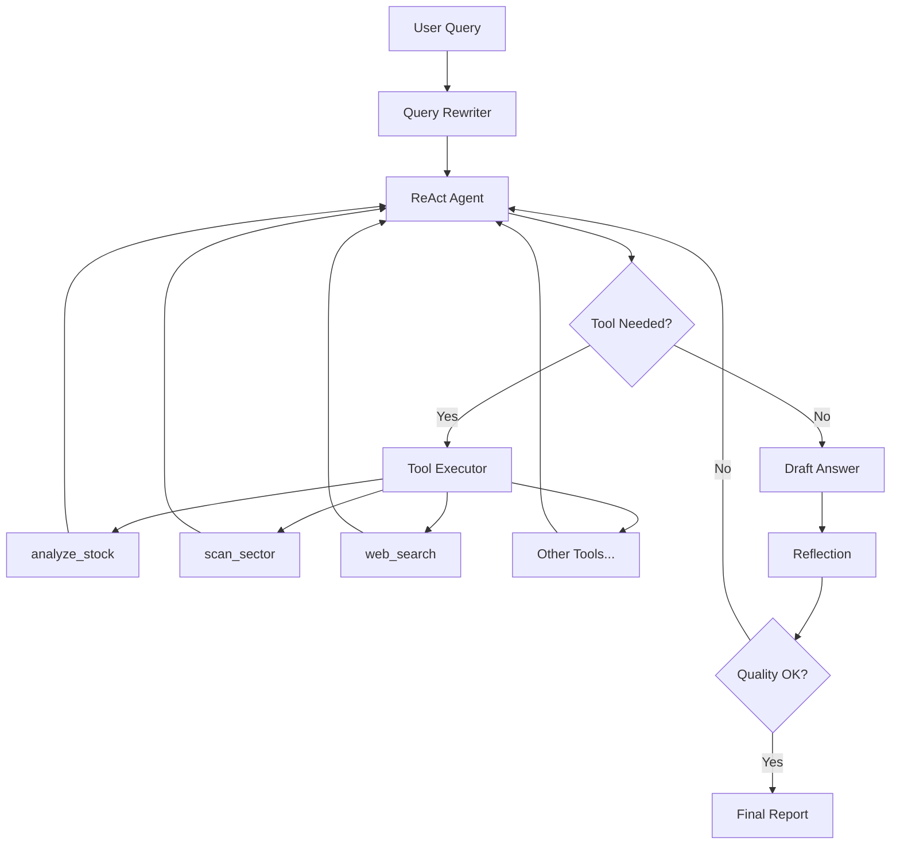
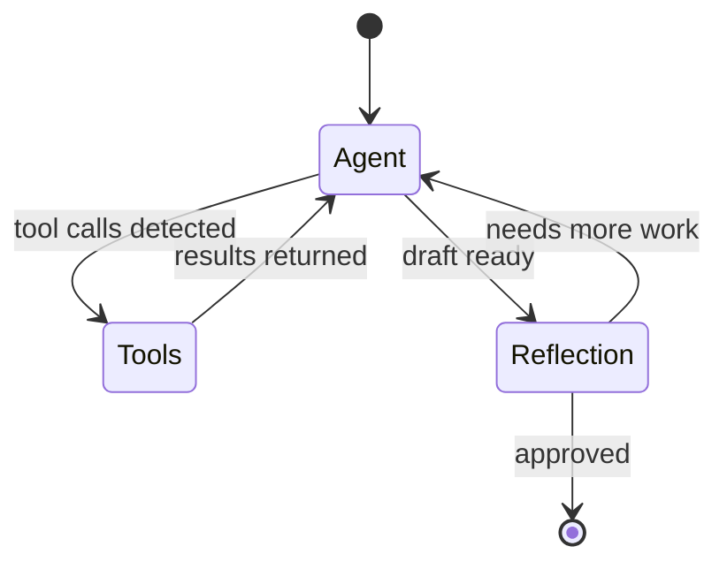
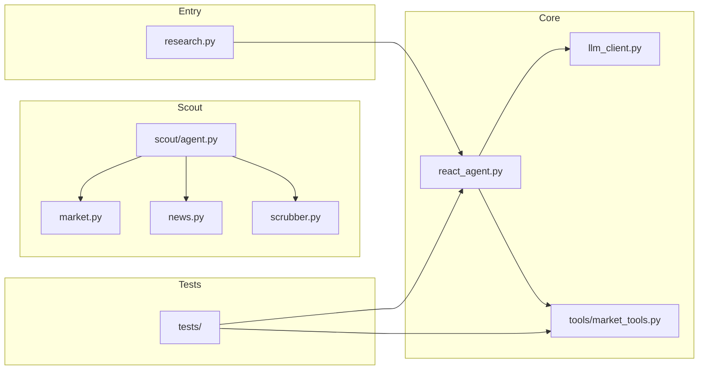

# Financial Research Agent

A sophisticated AI-powered financial analysis system built with LangGraph and ReAct pattern for Turkish and global markets.

## Features

- **ReAct Agent with Reflection** - Self-correcting agent that validates its own outputs
- **8 Specialized Financial Tools** - Stock analysis, sector scanning, portfolio building, and more
- **Turkish Language Support** - Native support for Turkish asset names and BIST stocks
- **Multi-LLM Support** - Works with Google Gemini and OpenRouter (GPT-4o-mini)
- **Scout Agent** - Automated market data and news collection

## Architecture



## Agent Flow



## Quick Start

### 1. Clone & Install

```bash
git clone https://github.com/yourusername/marketplace-analysis.git
cd marketplace-analysis
pip install -r requirements.txt
```

### 2. Set Up API Keys

Copy the example environment file and add your API keys:

```bash
cp .env.example .env
```

Edit `.env` and add at least one API key:
- `GOOGLE_API_KEY` - For Google Gemini
- `OPENROUTER_API_KEY` - For OpenRouter (GPT-4o-mini)

### 3. Run

```bash
# Single query
python research.py "Altın alınır mı?"

# Interactive mode
python research.py --interactive
```

## Available Tools

| Tool | Description |
|------|-------------|
| `analyze_stock` | Complete stock analysis with price, technicals, and signals |
| `scan_sector` | Analyze entire sector, return top 3 picks |
| `compare` | Compare 2-3 stocks side by side |
| `get_news` | Get recent news headlines for a company |
| `build_portfolio` | Allocate investment across stocks |
| `get_forex` | Currency exchange rates (USDTRY, EURTRY) |
| `get_fundamentals` | P/E, P/B, ROE ratios |
| `web_search` | Search for market trends and historical data |

## Project Structure



## Testing

```bash
# Run all tests
pytest

# Run with verbose output
pytest -v

# Run only unit tests
pytest -m unit
```

## Example Queries

```
"Bitcoin alınır mı?"
"Banka sektörü nasıl?"
"THYAO vs SAHOL karşılaştır"
"100.000 TL ile portföy oluştur"
"2024'te en çok kazandıran hisseler"
```

## Disclaimer

This tool is for educational and research purposes only. Not financial advice. Always do your own research before making investment decisions.

## License

MIT License
